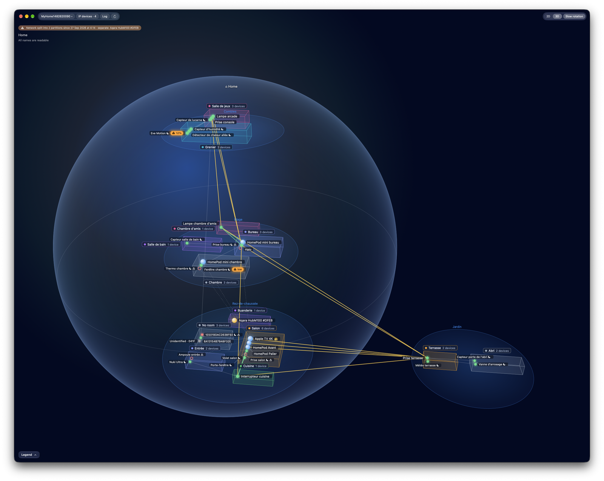
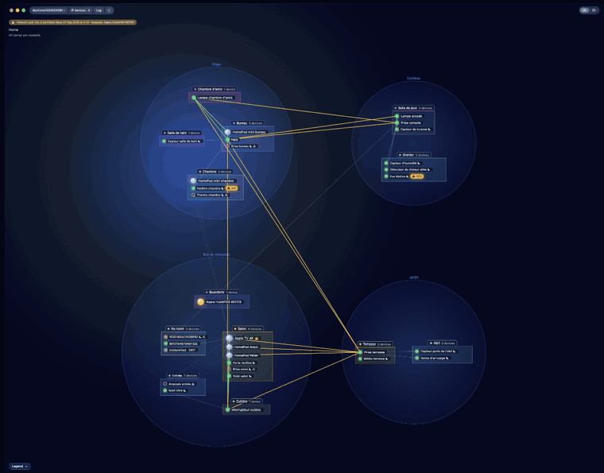
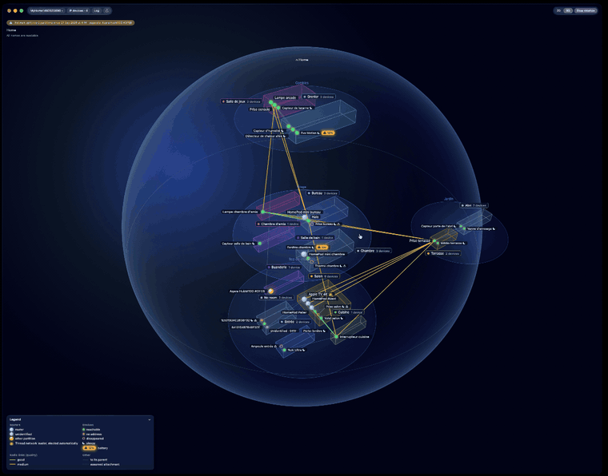
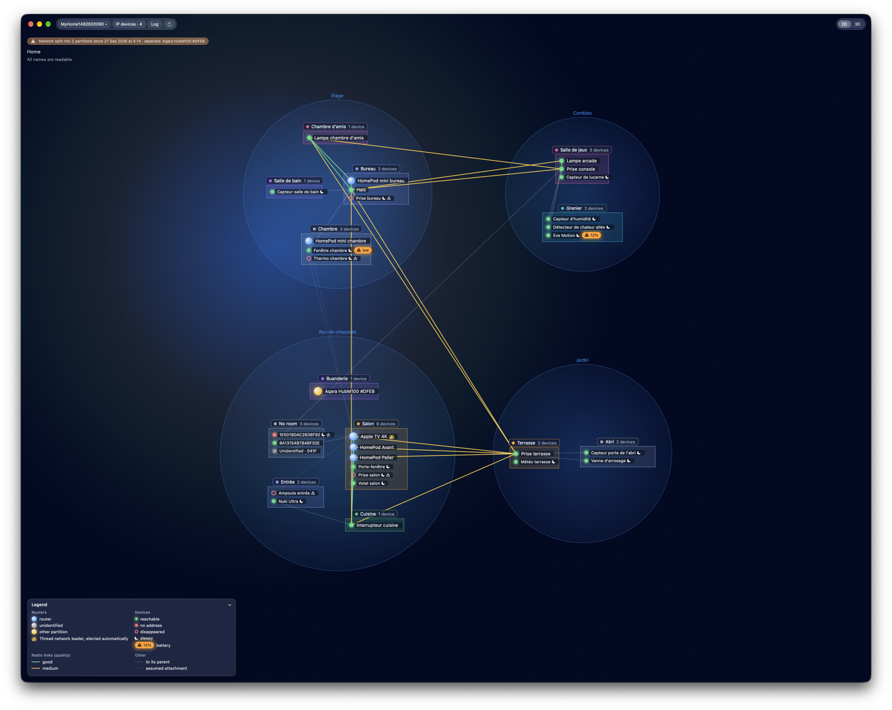
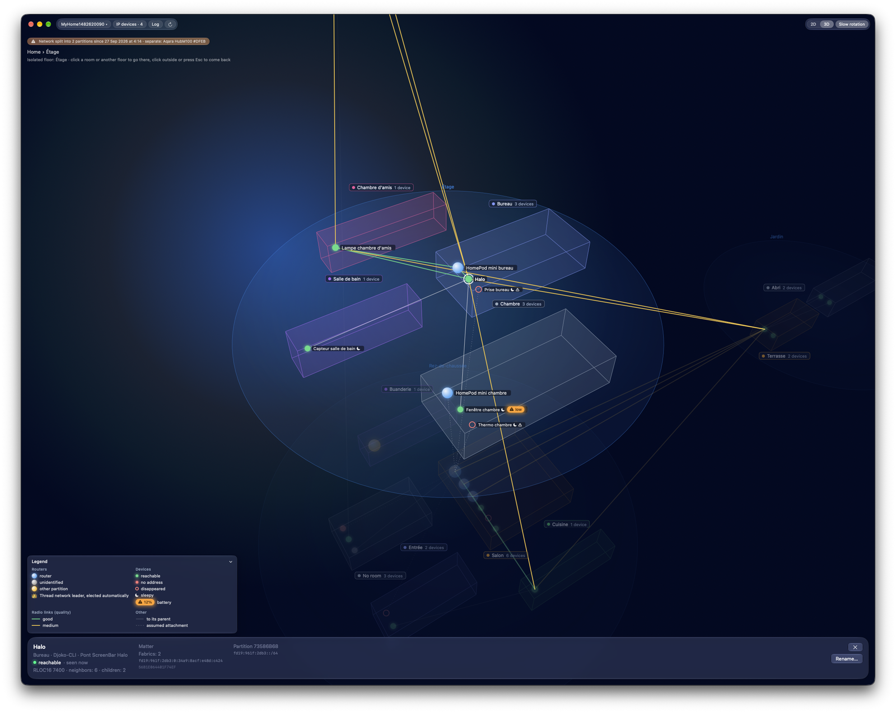
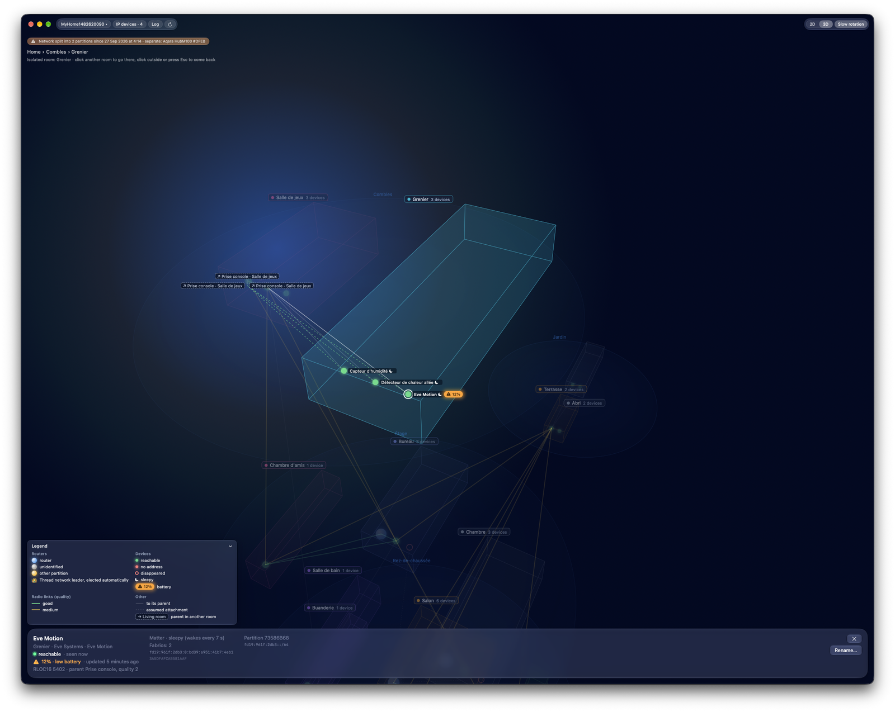

[English](README.md) · **Français**

# Maillage Thread

<p align="center"></p>

<p align="center">
  
  
</p>

<p align="center">
  
  
  
</p>

<p align="center"><sub>Mode démo : noms inventés, et maillage de sonde inventé sur les nœuds d'un vrai relevé.</sub></p>

App macOS native de la barre des menus (SwiftUI, Liquid Glass) qui montre le
réseau Thread vu depuis le Mac : routeurs de bordure, partitions et leur
chef, préfixes OMR, appareils Matter et HomeKit et la partition où ils se
trouvent. Elle tient un journal des changements (réseau scindé, routeur de
bordure qui redémarre ou disparaît, appareils perdus) et notifie les alertes.

Elle est née d'une vraie panne : le 27 septembre 2026, cinq appareils Thread
ont cessé de répondre à 04:14. À la main, depuis le Mac : le chef (une Apple
TV) avait publié un nouveau préfixe OMR à 04:04, et un hub Aqara s'était
retrouvé seul dans sa propre partition. L'app le montre d'un coup d'œil et
le garde en mémoire.

## Installer

Télécharger `Maillage-Thread-X.Y.Z.dmg` depuis la dernière
[version publiée](https://github.com/Djoko-cli/maillage-thread/releases) (`maillage-vX.Y.Z`),
l'ouvrir, et glisser **Maillage Thread** sur **Applications**. macOS 26 ou
plus.

- **Première ouverture (Gatekeeper).** L'app est signée par un certificat
  auto-signé, `Djoko-cli Code Signing`, sans Developer ID d'Apple ni
  notarisation. macOS refuse de l'ouvrir la première fois : dans Réglages
  Système, Confidentialité et sécurité, cliquer « Ouvrir quand même » en face
  de Maillage Thread, puis confirmer avec son mot de passe (depuis macOS 15, le
  clic droit ne suffit plus). Une seule fois.
- **Mises à jour automatiques** (Sparkle 2). L'app recherche une nouvelle
  version au démarrage puis toutes les 24 heures, la télécharge, vérifie sa
  signature Ed25519, et l'installe quand l'app se ferme, ou tout de suite par
  « Installer et relancer ». Une mise à jour installée ainsi ne repasse pas
  par Gatekeeper : la signature en tient lieu. « Rechercher les mises à
  jour… » est dans le menu ; Réglages, Général, « Mises à jour », porte
  « Rechercher automatiquement » et « Installer automatiquement », cochés par
  défaut. Une copie téléchargée avant la première version avec Sparkle
  (1.0.0) ne se met pas à jour seule.
- **Thread Route.** Pour joindre la sonde par le réseau Thread, il faut au
  Mac une route vers lui, que garde Thread Route (voir « Route vers le réseau
  Thread » plus bas). Il s'installe depuis une copie de ce dépôt :
  `sh outils/thread-route/installer.sh` (mot de passe administrateur).
  Réglages, Diagnostic, montre son état.
- **Passeur Noms n'est pas distribué.** C'est une app « conçue pour iPad »
  que chacun compile et signe avec sa propre équipe Apple :
  `outils/passeur.sh` (voir « Noms de Maison » plus bas).

## Crédits

L'app embarque [Sparkle](https://sparkle-project.org) 2.10.0 (les mises à jour automatiques), sous
licence MIT ; le texte de la licence est livré dans le `.dmg`, à côté de l'app (`Sparkle-LICENSE.txt`).

Le symbole de Thread de l'icône de la barre des menus est tracé d'après le logo du Thread Group
(Wikimedia Commons, `Thread_Group_wordmark.svg`, domaine public) ; Thread est une marque du Thread Group.

## Ce que le Mac peut voir

Le Mac n'a pas de radio Thread : l'app **écoute** seulement le réseau local.

| Source | Donne |
|---|---|
| `_meshcop._udp` (TXT) | routeurs de bordure : nom et identifiant du réseau (`nn`, `xp`), partition (`pt`), rôle (Thread 1.4 et plus, bits 9-10 de `sb`), BBR, jeu actif, préfixe OMR publié |
| `_matter._tcp` | une instance par appareil et par fabrique (`<fabrique>-<nœud>`), regroupées par hôte ; `ICD`, ou `SII` de plus de 2 s : appareil endormi |
| `_hap._udp` | accessoires HomeKit (leur nom) |
| `_trel._udp` (TXT) | routeurs qui passent aussi par le réseau local (TREL, `xa`) : leurs liens entre eux ne sont pas dessinés (carte radio seulement) |
| adresses des hôtes | préfixe OMR → partition ; réseau local → appareil IP ; aucune → « sans adresse » |
| table de routage du Mac | quel routeur de bordure route quel préfixe OMR |

« Joignable » veut dire *annoncé avec une adresse Thread dans la partition
principale*, pas « répond » : la joignabilité ne vient jamais de la sonde. Une
disparition n'est retenue qu'après 2 minutes d'absence et datée de la première
absence. Les vrais liens (enfant → parent, routeur ↔ routeur, qualité)
viennent de la sonde, un ESP32-C6 branché au Mac ou joint par le réseau
Thread (voir « Sonde » plus bas).

Les appareils sont placés d'après le préfixe OMR de leur adresse. Quand deux
partitions annoncent le même préfixe OMR (vu le 28 septembre : un hub isolé
avait repris le préfixe de la partition principale), le Mac ne peut pas
savoir de quel côté est un appareil : l'app donne le préfixe à la partition
qui a le plus de routeurs de bordure, et la fiche de l'appareil dit sa
partition « incertaine : préfixe partagé ».

## Construire, tester, lancer

Prérequis : macOS 26 ou plus, Xcode 26 ou plus (développé avec Xcode 27),
[XcodeGen](https://github.com/yonaskolb/XcodeGen) (`brew install xcodegen`).
Une dépendance, Sparkle 2 (2.10.0, les mises à jour), par le gestionnaire de
paquets Swift. Le projet Xcode est généré : seul `project.yml` est suivi.

```sh
outils/tester.sh                                   # génère, compile, tous les tests
outils/tester.sh MaillageCoeurTests/SuiviTests     # une suite
outils/mesurer.sh                                  # temps de calcul de la vue par pièces, en Release
```

Les produits de compilation vont dans `~/Library/Developer/Xcode/DerivedData/maillage`
(`DD` pour en changer). Swift 6, concurrence stricte complète, avertissements
traités comme des erreurs.

Lancer : `Maillage Thread.app` dans `…/DerivedData/maillage/Build/Products/Debug/`.
L'app vit dans la barre des menus ; la vue par pièces s'ouvre depuis son menu
(« Ouvrir le graphe », et d'elle-même au tout premier lancement).
Un gestionnaire de barre des menus (Bartender, Pelmet…) peut masquer son
icône : les nouvelles icônes arrivent du côté masqué.

### Mode démo

```sh
open "…/Maillage Thread.app" --args -demo
open "…/Maillage Thread.app" --args -demo -selection 86E7BD1A75F28E6D   # fiche ouverte
open "…/Maillage Thread.app" --args -demo -captures ~/Library/Containers/fr.djoko.maillage/Data/tmp/captures
```

Avec `-captures <dossier>`, l'app écrit vingt et une images PNG de la vue
par pièces (2D, envol, 3D, zooms, pièces isolées, survol, la fiche du chef, la
légende repliée ; puis les étages : la grille 2 × 2 dans une fenêtre carrée,
la même fenêtre en rangée, la 3D avec le jardin dans la maison, un étage isolé
en 2D et en 3D, une pièce isolée depuis son étage ; enfin un appareil à
mi-chemin de son glissement vers la cuisine), puis quitte, sans fenêtre.
Son rendu ne dessine ni la fenêtre ni le verre : le haut de la fenêtre, la
légende et la fiche y sont dessinés comme dans leurs maquettes, avec les trois
boutons de la fenêtre à leur place. L'app vit dans un bac à sable : le dossier
doit être dans son conteneur.

La démo rejoue la panne du 27 septembre, reconstituée à partir du relevé réel
du 28 septembre (`docs/releves/2026-09-28/`) : rien n'est écrit, rien n'est
notifié. Les noms de Maison de la démo sont inventés, comme le maillage de la
sonde dessiné sur les mêmes nœuds.

### Signature

`Signature.xcconfig` (suivi) signe ad hoc : le dépôt compile et teste
partout, sans compte Apple, mais l'autorisation « réseau local » ne tient pas
d'une compilation à l'autre. Pour signer Maillage Thread avec son équipe,
créer `Local.xcconfig` (ignoré par git) :

```
DEVELOPMENT_TEAM = <équipe, 10 caractères>
CODE_SIGN_IDENTITY = Apple Development
```

Si une installation ad hoc existe déjà, passer à la signature d'équipe fait
dire une fois à macOS « L'app diffère des versions précédemment ouvertes », et
l'autorisation « réseau local » est redemandée. Passeur Noms n'est signé avec
l'équipe que par `outils/passeur.sh` (voir plus bas).

### Publier une version

`outils/publier.sh X.Y.Z` publie la version X.Y.Z, le `MARKETING_VERSION` de
`project.yml`, depuis `main` à jour. Avant tout test, il vérifie que
l'étiquette et la version dans le flux n'existent pas encore (et que la
version dépasse la tête du flux), que l'arbre est propre, que l'auteur et le
committer Git sont `Djoko-cli`, à l'adresse noreply de GitHub, que le trousseau porte un
seul certificat `Djoko-cli Code Signing`, dont le sujet n'est que ce nom, et
que le contrôle d'anonymisation est sur le Mac (il est privé) : hors
répétition, sans lui, rien n'est publié. Puis il lance tous les tests,
compile en Release sans symboles de débogage et avec des chemins de sources
neutres, signe l'app par ce certificat (`IDENTITE_SIGNATURE`, dans
`publier.sh` seulement : les compilations de travail et les tests restent ad
hoc), et fait le `.dmg` (l'app, un raccourci vers Applications et la licence de
Sparkle). Il refuse tout binaire (celui de Sparkle compris) qui porte le
dossier personnel, `/Users/` ou le nom du compte, et toute donnée réelle que
trouve le contrôle d'anonymisation. Il signe le `.dmg` avec la clé Ed25519 du
trousseau (`sign_update` de l'archive de Sparkle 2.10.0, dont `SPARKLE_BIN`
donne le dossier `bin`), puis ajoute la version, avec les notes de
`NOTES-VERSIONS.md`, en tête du flux des mises à jour, `appcast.xml`, qui
garde toutes les versions publiées. Juste avant le premier geste public, il
relit l'état (`main` inchangée et à jour, `gh` connecté, `git push --dry-run`
qui passe, version publiée absente). Il crée alors la version publiée sur
GitHub par `gh release create --target`, qui crée aussi l'étiquette
`maillage-vX.Y.Z` sur le commit vérifié, avec le `.dmg` ; commite le flux sur
`main` et le pousse aussitôt ; et copie le `.dmg` sur le Bureau. Chaque geste
fait est noté dans `gestes.txt`, dans `build/publication/X.Y.Z/` : si le
script s'arrête en route, la suite se reprend depuis ce fichier et ce
dossier, geste par geste, sans relancer le script. Le numéro de compilation,
que compare Sparkle, est le nombre de commits de `main`. L'app lit son flux
dans le dépôt, à
`https://raw.githubusercontent.com/Djoko-cli/maillage-thread/main/appcast.xml` ;
chaque `.dmg` reste dans sa version publiée.
Avec `--repetition`, la même chose sans GitHub ni Bureau, pour un essai
local, avec une paire de clés d'essai et un certificat d'essai dans un
trousseau à part, s'ils sont donnés ; là seulement, le contrôle
d'anonymisation peut manquer. Une étape de notarisation (Developer ID)
est écrite, désactivée : `NOTARISER=1`, avec `PROFIL_NOTARISATION`, le
profil du trousseau que range `notarytool store-credentials`.
Tests : `/usr/bin/python3 -m unittest discover -s outils/tests`.

## Textes : français et anglais

Le français est la langue de développement (les clés des catalogues sont les
textes français), l'anglais est complet. Après un changement de texte :

```sh
outils/tester.sh                      # compilation : le compilateur extrait les clés
outils/synchroniser-textes.sh         # ajoute ou marque les clés du catalogue
python3 outils/traduire.py MaillageThread/Ressources/Localizable.xcstrings outils/traductions/<fichier>.json
```

`CataloguesTests` vérifie que chaque clé a son anglais et que le code et le
catalogue vont ensemble.

## Code

| Dossier ou fichier | Rôle |
|---|---|
| `MaillageCoeur/` | framework sans interface : décodage des TXT, instantané (réseaux, partitions, préfixes, appareils), suivi et événements du journal, journal en fichiers, noms, table de routage ; testé sur le relevé réel et sur la panne rejouée |
| `MaillageCoeur/Scene/` | vue par pièces, sans interface : nœuds et liens, étages et pièces, cartes, disposition (déterministe, avec budget), places gardées, caméra et envol, placement des noms et zoom sémantique, projection vers le moteur `Canvas` ; optimisé même en Debug |
| `MaillageCoeur/Maillage/` | sonde : TLV du diagnostic, Network Data, protocole USB, modèle du maillage, tournée (routeurs, annonces MLE entendues, résolution des parents, compteurs MAC des enfants), identités des routeurs gardées, rapprochement avec l'instantané (élimination, candidats), journal des parents et des routeurs Thread, historique des tournées et courbes ; testé sur une capture anonymisée |
| `MaillageThread/Sonde/` | liaison avec la sonde : port série sans redémarrer le C6, ports USB, accès par le réseau Thread (`Reseau/` : transport UDP et enveloppe H1 du pont Halo, clé dans le trousseau, rid et renvois), `SondeUSB` (requêtes appariées par id et par cible, chacune avec son échéance), modèle de l'app (sonde retenue par son numéro de série USB, liaison USB ou réseau, une tournée toutes les 5 minutes) |
| `MaillageThread/Noms/` | noms de Maison : lancement de Passeur Noms, réception de son relevé par la boucle locale (écoute TCP sur 127.0.0.1, jeton à usage unique), derniers noms valides gardés dans le conteneur de l'app |
| `MaillageThread/Recenseur/` | NWBrowser (trois types de service) et dns_sd (hôtes, adresses) → `Annonces` |
| `MaillageThread/Surveillance/` | modèle de l'app : relevés → suivi → journal et notifications ; veille du Mac ; ouverture à la connexion ; mises à jour (Sparkle) ; état de Thread Route |
| `MaillageThread/Vues/` | barre des menus, fenêtre de la vue par pièces (`Pieces/` : moteur `Canvas`, surcouches en verre, captures), journal, réglages (fenêtre AppKit à onglets : Général, Notifications, Maison, Sonde, Diagnostic ; ⌘,) |
| `Passeur/` | Passeur Noms : app iOS lancée sur le Mac (« conçue pour iPad ») qui lit Maison et envoie ses noms, pièces et zones à l'app par la boucle locale |
| `sonde/` | firmware de la sonde (ESP32-C6, PlatformIO) et outils d'essai |
| `outils/anonymiser-sonde.py` | anonymise une capture de la sonde avant d'en faire des données de test |
| `outils/mesurer.sh` | temps de calcul de la vue par pièces (disposition, placement des noms), en Release |
| `outils/thread-route/` | Thread Route, copie à l'identique de sa source (dépôt du pont Halo, `tools/macos/thread-route`), à la révision notée dans `outils/thread-route.source` ; `outils/synchroniser-thread-route.sh` la refait, `outils/tests/test_thread_route.py` la vérifie |
| `outils/publier.sh`, `outils/publication.py` | publication d'une version (voir « Publier une version ») ; tests dans `outils/tests/` |
| `NOTES-VERSIONS.md` | notes de version, en français et en anglais |
| `docs/releves/` | relevés réels (les données des tests et de la démo) |
| `docs/superpowers/` | conception (spec) et plans d'implémentation |

## Vue par pièces (2D et 3D)

La fenêtre montre le réseau dans la maison : un plateau rond par étage ou par
zone, une carte de verre par pièce avec une ligne par appareil, et les vrais
liens radio par-dessus. Elle reste sombre, comme sa maquette, même quand le Mac
est en clair. Conception :
`docs/superpowers/specs/2026-09-30-maillage-thread-vue-pieces-design.md`, et
pour les étages `docs/superpowers/specs/2026-10-03-maillage-thread-polissage-c-design.md`.

- **La fenêtre** n'a pas de barre de titre : la vue monte jusqu'en haut, sous
  les trois boutons de la fenêtre. Une barre d'outils vide et invisible, comme
  dans Plans, abaisse ces boutons et laisse de l'air au-dessus des deux
  capsules de verre, posées sur leur ligne : celle du réseau (menu du réseau,
  appareils IP, journal, rafraîchir) juste après les boutons, celle de la vue
  (2D / 3D, rotation lente) contre le bord droit. Glisser la bande vide entre
  elles déplace la fenêtre ; un double-clic y fait ce que fait un double-clic
  sur une barre de titre sur ce Mac (réglages Bureau et Dock). Dessous, contre
  le bord gauche, comme la légende : la ligne de la tournée, le bandeau d'un
  réseau scindé, le fil « Maison » et, juste sous lui, la ligne de niveau
  (une seule ligne, coupée si elle est trop longue). Le bouton vert passe en
  plein écran : la barre d'outils invisible s'y retire, les boutons s'y cachent
  jusqu'au survol du haut, qui les montre dans une barre de titre sombre
  (elle couvre la capsule le temps du survol), et la capsule du réseau prend
  leur place, contre le bord gauche. 820 × 732 points au moins, soit 680 sous
  la barre de titre cachée.
- **Légende** en bas à gauche, en verre : routeurs, appareils, liens radio
  par qualité et autres signes, seulement ceux que la vue montre, dessinés
  comme dans la scène ; la couronne du chef et la lune d'un endormi y sont
  seules, sans la pastille sombre des noms. Ouverte, la vue d'ensemble se
  cadre au-dessus d'elle ; son chevron (⌄) la replie sur son étiquette, qui
  rend la place, et le chevron de l'étiquette (⌃) la rouvre ; elle reste comme
  on l'a laissée. Une fiche ouverte la laisse visible, au-dessus d'elle ; si la
  fenêtre est trop basse pour les deux, elle se replie d'elle-même jusqu'à la
  fermeture de la fiche. Quand le relevé de la sonde est ancien, une pastille
  orange le dit, à côté de la ligne de niveau, en haut à gauche.
- **Étages et pièces.** Les étages sont les zones de Maison, dans leur ordre
  (le premier en bas) ; une pièce dans plusieurs zones va dans la première,
  les pièces hors zone forment « Autres pièces », et une maison sans zones n'a
  qu'un plateau « Maison ». Un appareil prend la pièce de son accessoire de
  Maison ; un routeur de bordure, celle de l'accessoire de Maison qui porte le
  nom de son annonce. Maison ne donne ni les HomePod ni l'Apple TV : un tel
  routeur va dans la pièce dont le nom figure dans le sien (« HomePod mini
  chambre » dans « Chambre » : en mots entiers, sans égard à la casse ni aux
  accents ; le nom de pièce le plus long gagne, une égalité ne place rien).
  La fiche de tout routeur de bordure que Maison ne place pas, même s'il est
  déjà placé par son nom, propose « Placer dans une pièce… » : ce choix
  l'emporte sur le nom, et il est gardé sous le nom de son annonce
  (`pieces-routeurs.json` dans le dossier de l'app, jamais en démo).
  « Placer dans une pièce… » sert aussi aux appareils que la sonde connaît
  mais que Maison ne reconnaît pas, par exemple un appareil Matter à pile
  dont l'annonce a expiré : le choix est gardé sous l'ExtMac de l'appareil,
  et « Sans pièce » l'efface. Les nœuds qui restent sans pièce vont dans
  « Sans pièce », sur le plateau du bas. Sans aucune pièce de Maison (Passeur
  Noms jamais passé), une carte par routeur, avec ses enfants.
- **Niveaux.** Une zone peut se mettre au niveau d'un étage, à côté de lui,
  dans la maison ou hors d'elle, comme un jardin à côté du rez-de-chaussée ;
  ce choix est gardé avec l'ordre des étages (`positions-pieces.json`, jamais
  en démo), et une zone dont l'étage disparaît redevient un étage.
- **2D et 3D** (capsule de droite ; le mode est gardé d'un lancement à
  l'autre) : la 2D est une vue de dessus, les plateaux en grille, remplie
  depuis le bas, ou en rangée (Réglages › Général › Vue par pièces › Étages en
  2D). La grille se choisit sur la zone visible, la fenêtre moins son haut et
  la légende, pour que la vue soit la plus grande possible : 2 × 2 dans une
  fenêtre carrée ou haute, souvent la rangée dans une fenêtre large, la légende
  ouverte. La 3D empile les niveaux dans la sphère de la maison, les zones à
  côté d'un étage à sa hauteur, dans la sphère ou autour d'elle, avec une
  rotation lente qu'on peut couper, qui continue autour d'une pièce ou d'un
  étage isolés et s'arrête pendant un geste. La bascule est un envol de 2,6 s ;
  les plateaux glissent vers leur place quand la fenêtre change de taille, quand
  la légende s'ouvre ou se replie, quand le réglage change, et après un
  changement de niveau.
- **Glissements.** Une nouvelle disposition (un relevé, un appareil placé dans
  une pièce, un choix de niveau) glisse en 0,9 s : les pièces et les appareils
  vont de leur place affichée à la nouvelle, un appareil en ligne droite d'une
  pièce à l'autre, d'un étage à l'autre s'il le faut ; les plateaux glissent
  avec eux en 3D, mais en 2D, après un changement de niveau, en 0,4 s ; ce qui
  apparaît ou disparaît le fait en fondu de 0,3 s, et les liens suivent. La vue
  suit ce qu'elle regarde. Un badge qui change (☾, ⚠︎, 👑, pile faible) ne
  fait plus bouger l'étage : chaque carte réserve la place des badges possibles
  de ses noms, la pastille de pile seulement pour un appareil dont la pile est
  connue. Un routeur de bordure non identifié, dont tous les candidats sont
  dans la même pièce, va dans cette pièce.
- **Gestes.** Molette ou pincement : zoom, vers le curseur en 2D ; au-dessus
  de la fiche, de la légende ou du haut de la fenêtre, la molette leur revient.
  Glisser le fond : déplacer la vue en 2D, tourner autour de la maison en 3D.
  Glisser une pièce : la déplacer dans son étage, sans que rien d'autre ne
  bouge (les autres pièces ne se replacent qu'à la disposition suivante) ; sa
  place est gardée (`positions-pieces.json` dans le dossier de l'app, jamais en
  démo). Clic sur une pièce ou sur son nom : l'isoler (les autres s'estompent,
  un repère montre un parent situé ailleurs) ; clic sur le nom ou le disque
  d'un étage : l'isoler de même. Échap ferme d'abord la fiche ouverte ; sinon,
  comme le clic à côté, il remonte d'un cran, d'une pièce à son étage si on
  l'a ouverte depuis lui, sinon à la maison, et ramène une vue zoomée à la vue
  d'ensemble ; là, il n'est pas pris et suit son chemin. Le fil « Maison ›
  Étage › Pièce » mène aussi à chaque cran. En 3D, ⌥ + glisser déplace la vue
  dans le plan de l'écran. Double-clic sur le fond ou sur un disque : retour à
  la vue d'ensemble, zoom et déplacement annulés. Clic sur un appareil ou sur
  son nom : sa fiche, qui glisse depuis le bas pendant que la vue se relève ;
  la fiche du chef du réseau Thread porte « 👑 Chef du réseau Thread, élu
  automatiquement ». Le premier clic agit aussi quand la fenêtre est inactive.
- **Clics droits** : sur le nom ou le disque d'un étage, le menu de son
  niveau, sous son nom : « Monter d'un étage » et « Descendre d'un étage »
  (tout le niveau), « Au même niveau que ▸ », « Hors de la maison » et « Sur
  son propre niveau » ; sur le fond, « Replacer les pièces automatiquement »
  (les places gardées partent, pas l'ordre des étages ni les niveaux) ; sur
  une pièce (sa boîte ou son nom) ou un appareil, aucun menu.
- **Zoom sémantique** : de loin, les pièces seules ; puis les routeurs ; de
  près, tous les noms qui tiennent. La ligne en haut à gauche, sous
  « Maison », dit le niveau, ou combien de noms sont masqués faute de place.
- « Réduire les animations » (accessibilité de macOS) : l'envol et le retour
  par double-clic deviennent un fondu, les autres vols de caméra sont
  immédiats, comme les glissements d'une disposition à l'autre, la rotation
  lente est coupée, la fiche, la légende et les bandeaux du haut vont et
  viennent par un simple fondu, et la vue se recadre par un fondu.
- La disposition des pièces est calculée hors du fil principal : quelques
  centièmes de seconde pour la démo, moins d'une seconde pour 20 pièces et 100
  appareils (`outils/mesurer.sh`).

## Noms de Maison (Passeur Noms)

HomeKit n'existe pas en macOS natif, et une équipe de développement Apple
gratuite ne peut pas le donner à une app Mac Catalyst. Les noms de Maison
viennent donc de **Passeur Noms**, une petite app iOS lancée sur le Mac
(« conçue pour iPad ») : elle lit Maison (noms, pièces, zones, fabricants,
`matterNodeID`, batteries), passe le relevé à Maillage Thread par la boucle
locale du Mac, et se ferme. Aucun dossier à choisir.

```sh
outils/passeur.sh          # compile avec ton équipe (compte Xcode), enveloppe, lance
```

- L'équipe vient de ton certificat « Apple Development » (`EQUIPE=` pour
  l'imposer). Une équipe gratuite a un profil de 7 jours : au-delà, Maillage
  Thread ne peut plus lancer Passeur Noms ; relancer le script. Seul Passeur
  Noms est signé avec l'équipe ; Maillage Thread reste ad hoc.
- Au premier lancement de chaque compilation, macOS dit que l'app est
  « endommagée » : cliquer Annuler, puis Réglages Système › Confidentialité et
  sécurité › « Ouvrir quand même ». Autoriser ensuite l'accès à Maison. Ouvert
  ainsi à la main, Passeur Noms lit Maison, montre ce qu'il a lu et se ferme
  après 10 s. Il n'envoie rien, sauf si Maillage Thread le demande pendant
  ces 10 s.
- Un relevé : Maillage Thread écoute sur `127.0.0.1` (TCP, sur un port choisi
  par le système), tire un jeton à usage unique et ouvre Passeur Noms en
  arrière-plan avec l'URL `maillage-passeur://releve?port=…&jeton=…` (une app
  du bac à sable ne peut pas passer d'arguments de lancement : macOS les
  retire). Passeur Noms lit Maison, se connecte, envoie le jeton, la longueur
  du JSON puis le JSON, et se ferme dès que l'app a tout lu. L'app vérifie le
  jeton, lit au plus 8 Mo et écrit `noms.json` dans son conteneur (écriture
  atomique). La boucle locale ne demande pas l'accès au réseau local. Limite
  connue : toute app de ce Mac peut ouvrir cette URL avec son propre port et
  recevrait le relevé ; rien ne sort du Mac.
- Priorité des noms : surnom > Maison > HomeKit (`_hap._udp`) > hôte.
- Le dernier relevé valide est gardé. Un échec (par exemple Passeur Noms
  introuvable ou refusé, rien en 2 minutes, jeton faux, longueur ou JSON
  illisible, accès à Maison refusé) le garde et se lit dans Réglages › Maison
  et dans le menu ; au-delà de 7 jours, les Réglages disent de relancer
  `outils/passeur.sh`. Passeur Noms note au journal pourquoi il
  s'est fermé :
  `/usr/bin/log show --last 10m --predicate 'subsystem == "fr.djoko.maillage.passeur"'`.
- Rafraîchissement : la fenêtre de la vue par pièces lance Passeur Noms à son
  ouverture (si le relevé et la dernière demande ont plus de 15 min), puis
  toutes les heures ; « Rafraîchir depuis Maison » (menu ou réglages) et le
  bouton rafraîchir de sa capsule du réseau le font à la demande. Un relevé à
  la fois : une demande pendant un relevé est ignorée. La fenêtre de Passeur
  Noms ne fait que passer derrière les autres.
- Zones : les zones de Maison (en général les étages) et leurs pièces, dans
  l'ordre de Maison ; Réglages › Maison en liste les noms. Un relevé d'avant
  les zones n'en a pas.
- Le `noms.json` écrit dans un dossier choisi par un ancien Passeur Noms (à la
  racine de ce dépôt, par exemple) n'est plus lu : l'effacer (git l'ignore).
- Batteries : niveau, état de charge et alerte de l'accessoire lui-même, pour
  chaque accessoire de Maison qui a une batterie. La fiche de l'appareil les
  montre avec l'âge du relevé ; dans la vue, une pastille orange en
  surbrillance, au bout du nom, signale une batterie faible (l'accessoire le
  dit, ou son niveau est de 20 % ou moins).

## Sonde (le vrai maillage)

Le Mac n'a pas de radio Thread. La **sonde** est un ESP32-C6 SuperMini branché
au Mac en USB et ajouté à Maison comme appareil Matter sur Thread (une prise
« Sonde maillage »). C'est un enfant qui ne devient jamais routeur (FED depuis
le firmware 1.0.2) : elle écoute en permanence mais ne relaie rien, donc elle
n'est le parent de personne. Elle envoie pour l'app les requêtes de
diagnostic Thread (`DIAG_GET`) et lui rend les réponses brutes, par l'USB ou,
une fois l'accès autorisé, par le réseau Thread ; l'app les décode et
reconstruit le maillage. Depuis le firmware 1.1.0, elle entend aussi les
annonces MLE des routeurs qui l'entourent et résout le parent de chaque
appareil (voir plus bas).

Le **pont Halo** est l'autre projet ESP32-C6 de l'auteur, un pont Matter sur
Thread pour une lampe ScreenBar Halo, dans un autre dépôt. L'accès de la sonde
par le réseau est celui du pont, tel quel, **enveloppe H1** comprise : une
poignée de main signée, puis des messages qui portent chacun un compteur et un
HMAC.

```sh
cd sonde && pio run        # compiler ; flasher et appairer : sonde/README.md
```

- Dans Maillage Thread : Réglages › Sonde › Port. L'app n'ouvre que le port
  choisi : un autre ESP32-C6 branché (le pont Halo, par exemple) n'est jamais
  ouvert. La sonde est retenue par son numéro de série USB et s'affiche sous
  son nom, « SONDE-01 » par défaut : le firmware le garde, il suit donc la
  carte d'un Mac à l'autre (le nom USB du C6 est fixé par la puce). Branchée,
  elle est reprise seule ; si elle démarre trop lentement, l'app réessaie une
  fois 5 s plus tard. Tout autre port s'affiche avec son numéro de série USB
  (« usbmodem… · » suivi du numéro), seul moyen de distinguer la sonde du pont
  Halo avant la première connexion. La ligne du menu prend aussi
  ce nom (« SONDE-01 : connectée · relevé il y a 2 minutes »), comme l'état
  dans Réglages › Sonde (« SONDE-01 · connectée ») ; pas pour un autre port
  en essai.
- Réglages › Sonde montre le QR code Matter de la sonde et son code
  d'appairage (4-3-4), même une fois dans Maison, en USB seulement : ils ne
  passent jamais par le réseau, et une note le dit à leur place.
- **Accès par le réseau Thread** (firmware 1.0.2, comme le pont Halo), pour
  débrancher la sonde du Mac et la promener dans la maison afin d'entendre
  tous les routeurs. Sonde branchée et connectée, « Autoriser l'accès
  réseau » (Réglages › Sonde) crée par l'USB une clé qui reste dans le
  trousseau de ce Mac ; le bouton devient ensuite « Régénérer une clé » (une
  nouvelle clé remplace l'ancienne), et le choix « Liaison » (USB ou Réseau
  Thread) paraît. Par le réseau, l'app ferme le port, se connecte seule à
  `<nom d'hôte>.local`, port UDP 5480, et se reconnecte ; une veille part
  après 10 s de silence, et Réglages › Sonde garde la cause de la dernière
  perte jusqu'à la connexion suivante. L'enveloppe H1 de Halo authentifie les
  messages sans les chiffrer : la topologie circule en clair sur le réseau
  local. Le Mac doit avoir une route IPv6 vers le préfixe OMR (voir
  « Route vers le réseau Thread » plus bas). « Oublier la sonde » retire la
  clé de ce Mac, le relevé de la sonde dans les Réglages et son maillage : la
  vue revient aussitôt aux pointillés.
  Limites : pas de fin de session (une place de la carte reste prise 30 s,
  la reprise automatique le répare) ; la file de réception de la carte n'a
  que 4 places (un envoi groupé de 8 `diag` peut en voir attendre le renvoi à
  2 s) ; une ligne `routeurs` perdue donne une table partielle, ou aucune si
  la dernière (`"suite":false`) se perd ; détails dans la spec (section
  3 bis).
- Une tournée toutes les 5 minutes, et au rafraîchissement : le bouton
  rafraîchir de la capsule du réseau relit le réseau, lance une tournée (sauf
  s'il y en a déjà une) et Passeur Noms ; son aide dit lesquels il lancera
  vraiment. Pendant une tournée, une ligne en haut à gauche, sous les capsules
  (au-dessus du bandeau d'un réseau scindé), montre son étape, un compteur de
  requêtes et sa durée (« Résolution des parents · 12/26 · 0:42 »). Elle
  n'est là que pendant la tournée : le bandeau et le fil remontent quand elle
  disparaît, et redescendent quand elle paraît. La vue, elle, ne bouge pas :
  sa marge du haut garde la place de la ligne tant qu'une sonde est retenue,
  pour ne pas se recadrer toutes les 5 minutes. Réglages › Sonde et la ligne
  du menu montrent aussi l'étape et le compteur.
- La liste des routeurs vient du chef ; s'il se tait, d'un routeur qui a déjà
  répondu ; sinon des autres routeurs de la table de la sonde, puis d'une
  recherche sur tous les identifiants de routeur (pas de nouveau dans les 30
  minutes qui suivent une recherche vaine). Sans liste, pas de nouveau
  maillage : le dernier vieillit.
- La tournée demande ensuite à chaque routeur qui répond ses liens (avec la
  qualité dans chaque sens) et ses enfants, lit les routeurs de bordure dans
  les Network Data, et demande à chaque enfant listé dans la table d'un
  routeur son identité (ExtMac, adresses), au plus une fois par demi-heure,
  endormis compris (l'ExtMac d'un appareil Matter est son nom d'hôte).
- **Les routeurs de bordure d'Apple ne répondent jamais au diagnostic.**
  Depuis le firmware 1.1.0, la sonde y supplée de deux façons, ci-dessous :
  l'écoute et la résolution des parents. Elles remplacent le balayage des
  RLOC16 d'enfant possibles, qui manquait les enfants muets au diagnostic.
  Les compteurs MAC des enfants ne sont montrés qu'à titre d'information.
- **L'écoute.** La sonde entend les annonces MLE des routeurs à portée de sa
  radio et les déchiffre sur la carte : elle tire la clé MLE de la clé
  réseau, qui ne quitte jamais la carte et s'efface aussitôt. Chaque annonce
  porte la table de routage du routeur (Route64), donc ses liens dans les
  deux sens avec chacun des autres routeurs, ceux d'Apple compris. Après
  l'état de la sonde, sa table des routeurs et ses voisins, la tournée les
  demande (`annonces` ; sans réponse, elle saute la résolution et les
  compteurs, et continue) et garde les
  routeurs de sa partition : ceux d'une autre partition (celle d'un hub
  Aqara, par exemple) sont écartés. Pour une paire de routeurs, chaque sens
  garde la mesure la plus récente, diagnostic ou écoute, datée de l'âge que
  donne la sonde ; un lien connu d'un seul côté est affiché.
  **Carte radio seulement.** Les routeurs qui annoncent TREL (`_trel._udp`,
  Thread par le réseau local, comme ceux d'Apple) peuvent se parler par le
  Wi-Fi ou l'Ethernet, et leur Route64 ne dit pas si un lien passe par la
  radio : un lien entre deux routeurs TREL n'est pas dessiné. Restent les
  liens d'un routeur sans TREL (Nanoleaf, Eve…) et ceux des enfants vers
  leur parent, qui sont radio. Chaque annonce
  relie aussi un RLOC16 à une ExtMac, comme le parent de la sonde.
- **La résolution des parents**, toutes les 30 minutes et quand un appareil
  paraît : pour chaque appareil Matter ou HomeKit sur Thread que l'app
  connaît avec une adresse sur le préfixe OMR de sa partition, la sonde fait
  résoudre cette adresse par OpenThread (`resoudre`, 8 en vol). Le parent
  répond pour son enfant endormi, et le cache d'adresses de la sonde donne le
  RLOC16 trouvé : sans ses 10 bits de poids faible, c'est celui du parent.
  Les routeurs Apple répondent avec leur propre RLOC16, les routeurs tiers
  avec celui de l'enfant. L'enfant est rattaché à son parent, daté (sous un
  routeur qui répond au diagnostic, sa table des enfants l'emporte) ; un
  appareil non résolu reste en pointillés (« rattachement supposé »), comme
  avant.
- **Les compteurs MAC des enfants des routeurs Apple, à titre
  d'information.** À chaque résolution, l'app demande à chaque enfant d'un
  routeur muet (ceux d'Apple) ses compteurs MAC (TLV 9, à son ML-EID, que
  donne le cache d'adresses : le diagnostic n'est accepté que sur les
  adresses internes du réseau). Dans OpenThread, leur `ifOutErrors` compte
  les échecs d'accès au canal (CCA, à chaque tentative), pas les accusés
  manquants : rapportés aux trames unicast envoyées, entre deux relevés, ils
  disent l'occupation du canal autour de l'enfant, pas la qualité de son
  lien avec son parent. Ils ne donnent donc aucune qualité : un enfant d'un
  routeur Apple reste en qualité inconnue (gris), et sa fiche montre
  seulement « accès au canal refusés : 0,7 % » sur la ligne de son parent.
  Sous 50 trames envoyées entre les deux relevés, pas de valeur ; un
  compteur qui baisse (l'appareil a redémarré) fait repartir les relevés.
  Sous un routeur tiers, la qualité vient de sa table des enfants, comme
  avant.
- **Ce que l'écoute apporte, et ses limites.** La sonde n'entend que les
  routeurs à portée de sa radio ; un seul routeur entendu donne tous ses
  liens, et un lien paraît dès que l'un de ses deux bouts est entendu. Une
  sonde mal placée n'apporte jamais moins qu'avant : le diagnostic, la
  résolution et les compteurs ne dépendent pas de sa position. Réglages ›
  Sonde montre la couverture, « routeurs entendus : 5 sur 7 » (sur les
  routeurs de sa partition) ; déplacer la sonde la fait varier. La qualité
  du lien entre un enfant et son parent Apple reste inconnue : le parent ne
  la donne pas, et les compteurs MAC de l'enfant ne la mesurent pas.
  La résolution ne traverse pas les partitions : les enfants d'une autre
  partition restent inconnus. Le
  maillage est une photo datée : liens et parents changent, et la fiche
  donne l'âge de chaque information. Avec un firmware antérieur à 1.1.0, la
  tournée s'en tient au diagnostic.
- **Identité des routeurs de bordure.** Muet, un routeur d'Apple ne donne pas
  son ExtMac, donc pas le nom de son annonce. La sonde (firmware 1.0.2)
  apprend celle des routeurs qu'elle entend : chaque tournée lit sa table des
  routeurs (`routeurs`) et, depuis le firmware 1.1.0, leurs annonces MLE, et
  retient chaque paire RLOC16 ↔ ExtMac, comme celle de son parent, même
  quand la tournée n'aboutit pas. Ces identités sont
  gardées d'un lancement à l'autre avec leur partition
  (`identites-routeurs.json` dans le dossier de l'app ; une autre partition
  les efface, et la paire d'un routeur sorti de la liste des routeurs est
  oubliée) : déplacée dans la maison, la sonde les apprend toutes. Le chef,
  s'il est un routeur de bordure, est l'annonce de sa partition dont le rôle
  est chef, si elle est la seule ; avec deux (un cache périmé), il reste non
  identifié, avec les deux pour candidates. S'il ne reste qu'un routeur de
  bordure non identifié pour une seule annonce, c'est lui, par élimination.
  Sinon, il s'affiche avec ses candidats,
  « HomePod Avant ou HomePod Palier · 0400 » (« HomePod salon ? · 0400 »
  pour un seul), et ces annonces ne sont plus dessinées à part : un seul nœud
  par routeur. Sa fiche liste les candidats ; chacun ouvre la fiche de son
  annonce. Sans sonde, toutes les annonces restent dessinées.
- Dans la vue par pièces, les traits pleins entre routeurs sont les liens
  radio (2 points, colorés par la qualité : vert 3, jaune 2, orange 1, gris
  inconnue) ; le trait d'un enfant vers son parent reste fin. Un lien est un
  lien : même trait et même couleur, quelle que soit sa source. Les
  pointillés restent pour ce que la sonde ne voit pas. Le chef du maillage
  porte la couronne. La fiche donne le parent et la qualité, ou le nombre de
  voisins et d'enfants d'un routeur, et la source et l'âge de chaque lien
  (« diagnostic », « entendu il y a 3 minutes », « résolu il y a 12
  minutes », « accès au canal refusés : 0,7 % ») ; pour un routeur
  que la sonde n'a jamais entendu, « jamais entendu par la sonde ; liens vus
  seulement par ses voisins ». Si la sonde ne répond plus, le dernier
  maillage est marqué ancien 6 minutes après sa réception (jamais pendant
  une tournée) ; après 15 minutes, la vue revient aux pointillés. La vue se
  redessine chaque minute : ces deux changements y paraissent avec une
  minute de retard au plus, sans autre événement, comme le « vu il y a … »
  et les courbes de la fiche ouverte.
- Éteindre « Sonde maillage » dans Maison suspend la sonde : pas de tournée,
  même après un redémarrage de la sonde. Sa LED donne alors un bref éclair
  orange toutes les 5 s (firmware 1.0.3). Après un `oubli`, la commande USB
  qui désappaire la sonde (voir `sonde/README.md`), la sonde revient allumée,
  comme à sa première mise en service.
- **Journal et historique** (plan 3b). Chaque tournée compare son maillage à
  celui de la précédente et note au journal (famille « Maillage ») : « X a
  changé de parent : A → B », « X n'a plus de parent » (absent de deux
  tournées où son absence est sûre ; pour un enfant connu seulement par la
  résolution, sous un routeur de bordure d'Apple, absent de deux résolutions
  distinctes, en général à 30 à 60 min d'écart) et l'apparition ou la
  disparition d'un routeur Thread hors routeurs de bordure ; les changements
  de parent d'un même nœud dans l'heure tiennent sur une ligne (« X a changé
  4 fois de parent en 1 h »). Seuls les enfants identifiés (ExtMac) sont
  suivis. Pas de notification par défaut (« Autres changements »). Chaque
  tournée ajoute aussi une ligne à `maillage-AAAA-MM.jsonl`, dans le dossier
  de l'app (gardé 90 jours, environ 8 Mo par mois pour 7 routeurs et 20
  enfants, jusqu'à 12 Mo avec les liens entendus et leurs sources) : la
  qualité de chaque lien et, depuis la 1.1.0, sa source (diagnostic ou
  écoute) et le taux d'accès au canal refusés des enfants, à titre
  d'information (il ne donne aucune qualité ; les fichiers d'avant se lisent
  comme avant), et le signal de chaque routeur que la sonde
  entend (`voisins`) et de son parent (`etat`). La fiche d'un nœud en tire
  ses courbes sur 24 h, 7 j ou 30 j : la qualité de ses liens, changements
  de parent marqués, et pour un routeur le « Signal vu par la sonde », où les
  changements de parent de la sonde sont marqués (le signal dépend d'abord de
  l'endroit où elle est posée) ; son échelle, en dizaines de dBm, a toujours
  ses graduations, même pour un seul relevé, et le survol donne la valeur et
  l'heure du relevé le plus proche. Rien de tout cela en démo.
- Les captures de la sonde contiennent les adresses du réseau de la maison :
  `outils/anonymiser-sonde.py` les réécrit de façon cohérente avant qu'elles ne
  deviennent des données de test (`docs/releves/2026-09-29/`) : ExtMac et nom
  d'hôte SRP, préfixes, adresses, MAC, nom et empreinte de la clé de la sonde
  (plan 3b). Il connaît les messages du firmware 1.0.3 et ceux de cette
  capture, la forme de chaque champ et les TLV de diagnostic que la tournée
  demande, jusque dans la Network Data ; il échoue devant tout le reste, les
  messages nouveaux du firmware 1.1.0 compris (`annonces`, `resoudre`, les
  compteurs de l'écoute, la TLV 9), sans rien écrire. Une capture déjà
  anonymisée ressort telle quelle. Les textes libres (fabricant, modèle,
  versions, messages de la sonde) sont refusés au moindre motif
  d'identifiant, adresse ou chiffres hexa même coupés par des séparateurs :
  une date ISO peut l'être aussi. Un identifiant déguisé exprès dans une
  chaîne d'un firmware (hexa coupé par d'autres lettres) passerait.

### Route vers le réseau Thread

Par le réseau, l'app joint la sonde à son adresse dans le préfixe OMR, un /64
que les routeurs de bordure (HomePod, Apple TV…) annoncent au réseau local.
macOS n'installe pas toujours la route vers ce préfixe, et peut la perdre en
changeant de routeur de bordure sans la remettre : la sonde est alors
injoignable, et l'app dit « Pas de route IPv6 vers le réseau Thread ». Il
faut au Mac une route vers ce /64 par l'un des routeurs de bordure qui
l'annoncent (la poser demande les droits d'administrateur). Thread Route la
garde : un démon launchd (root) du dépôt du pont Halo, dont
`outils/thread-route/` est une copie à l'identique. Il s'installe par
`sh outils/thread-route/installer.sh`, sous son compte (le mot de passe
administrateur n'est demandé que pour l'installation) ; voir son README.
L'app ne peut pas l'installer elle-même : dans le bac à sable, `SMAppService`
refuse un démon qui n'y est pas (essai du 06/10/2026). Réglages, Diagnostic,
montre son état : absent, désactivé dans Réglages Système, actif, ou encore
sous son ancien nom, halo-routes, que l'installateur remplace : il l'arrête,
attend (25 s au plus) que launchd l'ait déchargé, et ne retire ses fichiers
qu'ensuite ; si l'attente expire, il s'arrête sans rien retirer.
